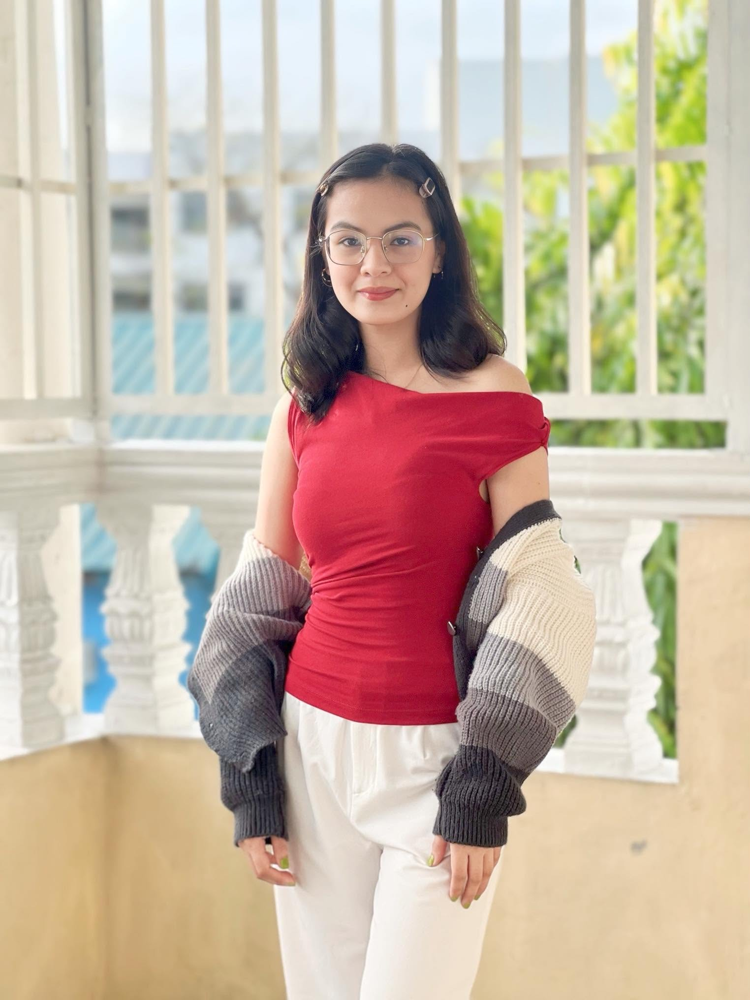
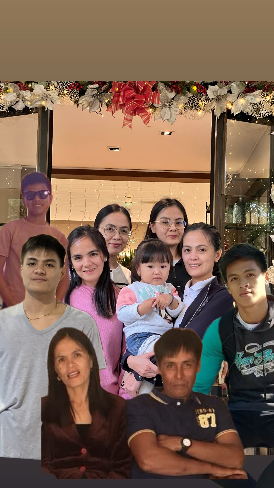
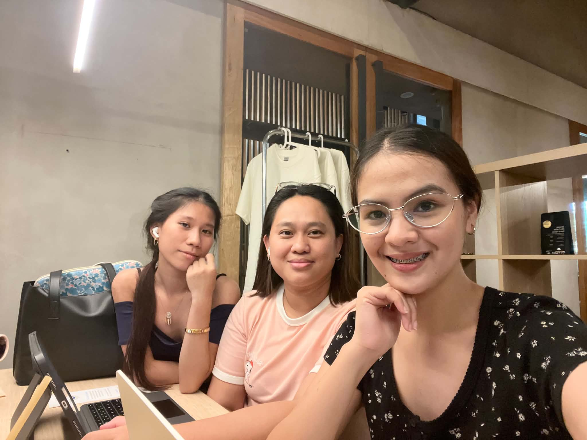
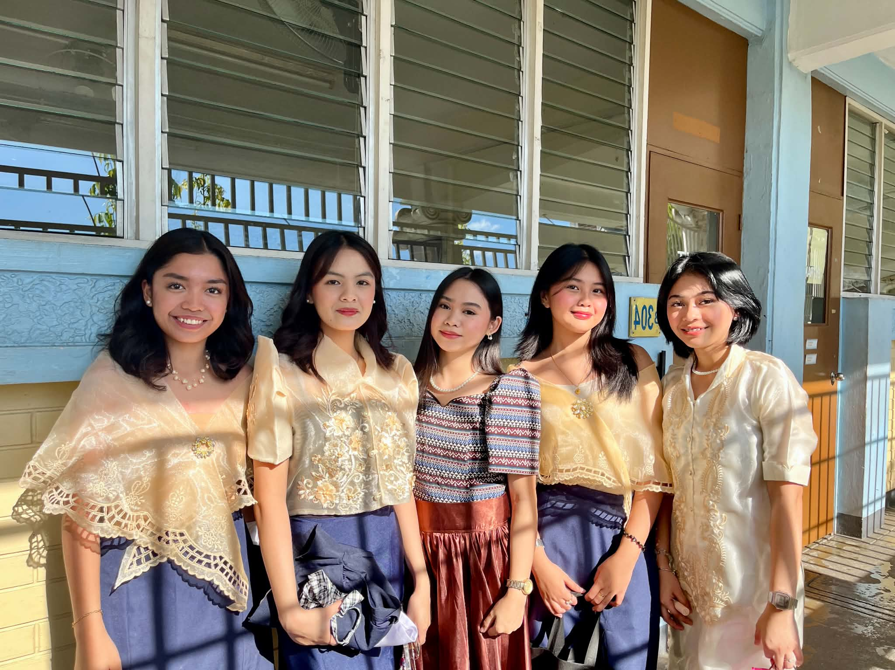
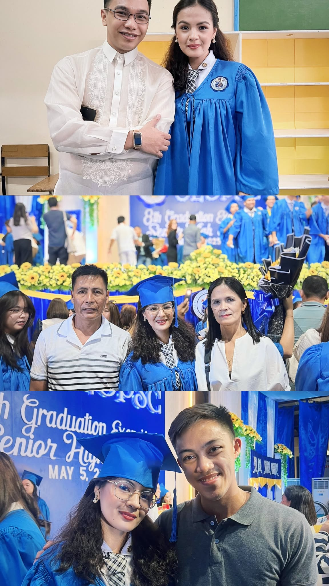
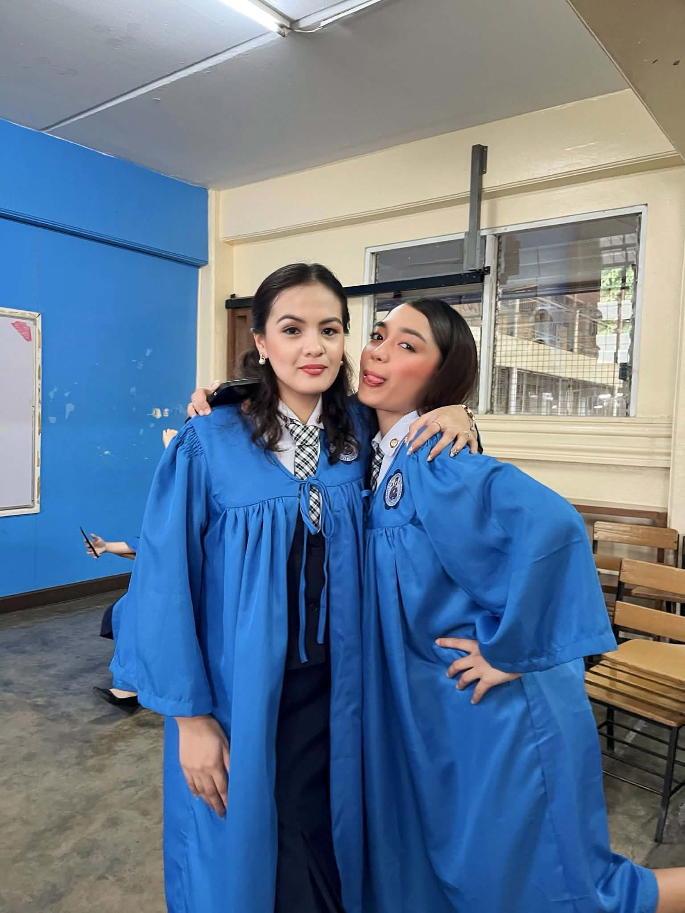

<html lang="en">
<head>
<meta charset="UTF-8">
<meta name="viewport" content="width=device-width, initial-scale=1.0">
<title>Roxanne B. Figuro | Personal Website</title>

<link href="https://fonts.googleapis.com/css2?family=Poppins:wght@300;400;500;600&family=Playfair+Display:wght@600;700&display=swap" rel="stylesheet">

</head>

<body>

🎀

🎀

🎀

<header>
<h1>🎀 Roxanne B. Figuro 🎀</h1>

My Personal Website

</header>

<nav>
<a href="#about">About</a>
<a href="#education">Education</a>
<a href="#family">Family</a>
<a href="#collection">Collections</a>
<a href="#gallery">Gallery</a>
<a href="#advocacy">Advocacy</a>
</nav>

<!-- ABOUT -->

<section class="section" id="about">

<!-- CHANGE THIS TO YOUR PHOTO -->

<h2></h2>

Hi! Welcome to my personal website.
This website is created to share my personal life, education, family, friends, interests, achievements, and my advocacy for social change.
Through this, you will know more about me as a student, daughter, friend, and as a person with dreams and goals in life.

<strong>Name</strong> 
Roxanne B. Figuro

<strong>Age</strong> 
19 Years Old

<strong>Birthdate</strong> 
September 01, 2006

<strong>Favorite Colors</strong> 
Pink 💗 & Yellow 💛

</section>

<!-- EDUCATION -->

<section class="section" id="education">

<h2>🎓 Educational Background</h2>

<h3>GS (Elementary)</h3>

I completed my elementary education at Sumnanga Elementary School.
This is where I learned the basic foundations of reading, writing, and mathematics.
My elementary years helped me build discipline, confidence, and the habit of learning every day.

<h3>HS (High School)</h3>

I studied high school at Sabtang National School of Fisheries.

<h3>SHS (Senior High School)</h3>

I completed my senior high school at Our Lady of Perpetual Succor College.

<h3>College</h3>

I am currently a 1st Year College Student at Lyceum of the Philippines University – Manila.

</section>

<!-- FAMILY -->

<section class="section" id="family">

<h2>👨‍👩‍👧‍👦 Family Menu</h2>

<ul class="family-list">
<li><strong>Father:</strong> Teodoro A. Figuro</li>
<li><strong>Mother:</strong> Basilisa B. Figuro</li>
<li><strong>Siblings:</strong> Rizza B. Figuro, Rachel B. Figuro, Rosevail B. Figuro, Richmond B. Figuro, Rich Joshua B. Figuro, Reiven B. Figuro</li>
<li><strong>Grand Parent:</strong> Irene B. Beronque</li>
</ul>

</section>

<!-- COLLECTIONS -->

<section class="section" id="collection">

<h2>💖 Collections & Interests</h2>

👗
<h3>Fashion & Styling</h3>

✈️
<h3>Travel to New Places</h3>

🧴
<h3>Skincare & Self-Care</h3>

📸
<h3>Aesthetic Photography</h3>

🖤💗
<h3>BLACKPINK</h3>

🎤
<h3>Sabrina Carpenter</h3>

</section>

<!-- GALLERY -->

<h2>📸 My Gallery</h2>

<!-- Replace with your photos -->

</section>

<!-- ADVOCACY -->

<section class="section" id="advocacy">

<h2> Sustainable Developmental Goals </h2>

I believe that everyone can contribute to making the world a better place. 
The Sustainable Development Goals (SDGs) inspire me to be more responsible, caring, and mindful of my actions. By supporting quality education, protecting the environment, promoting equality, and helping those in need, we can create positive change in our communities. Through awareness and collective effort, we can work toward a more sustainable, inclusive, and prosperous future for everyone.
May earth and trees

 

</section>

<footer>
🎀 Made with Love by Roxanne B. Figuro 🎀
</footer>

